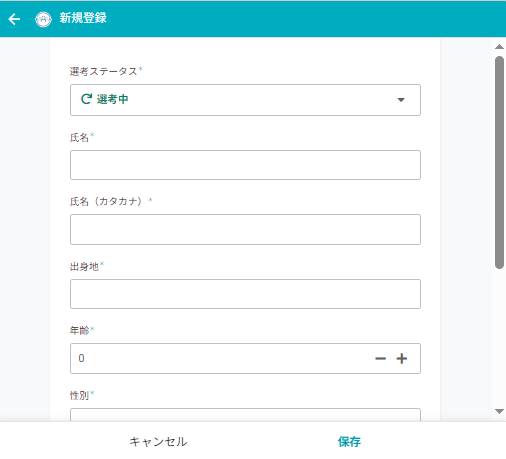
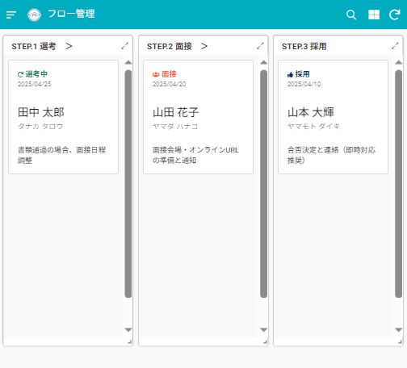
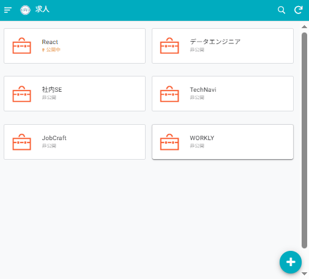
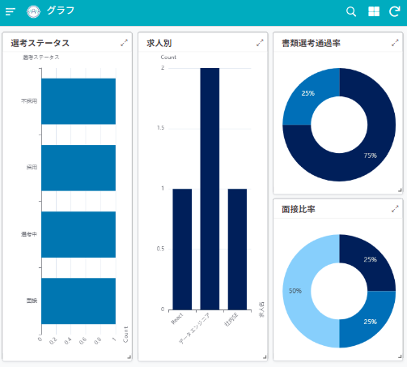
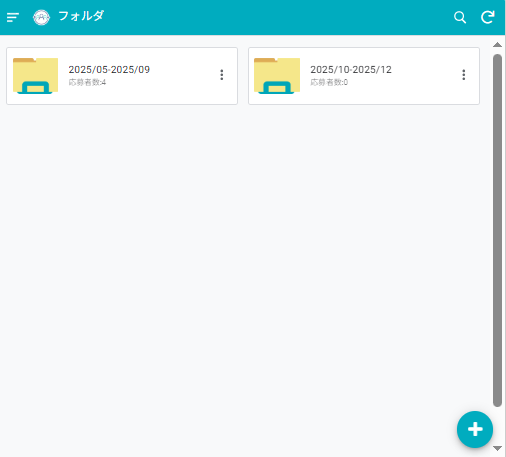

# 採用管理アプリ ATS（AppSheet）

> AppSheetで構築した採用管理システム（Applicant Tracking System）
> 応募者情報の一元管理・選考フローの可視化・タスク管理を一つのアプリで実現

---

## 解決した課題

- 応募者情報がチャット・メール・スプレッドシートに分散していて管理が煩雑だった
- 選考ステータスが担当者によってバラバラで、進捗の把握に時間がかかっていた
- **→ AppSheetで一元管理し、誰でも同じ画面で状況を確認できるようにした**

---

## デモ

> サンプルアプリ（閲覧専用・ダミーデータ使用）
> 👉 [AppSheet デモリンク]

---

## スクリーンショット

### 新規登録画面


### 選考フロー画面


### 求人一覧


### グラフ・分析


### データフォルダ


---

## 🛠 実装した機能

| 機能 | 内容 | 状態 |
|---|---|---|
| 応募者情報管理 | 基本情報・選考履歴の一元管理 | ✅ 実装済 |
| 新規登録画面 | 必要項目に絞ったフォーム画面 | ✅ 実装済 |
| 選考ステータス管理 | 選考フローを視覚的に表示 | ✅ 実装済 |
| タスク管理機能 | 採用担当者の対応をタスク化 | ✅ 実装済 |
| グラフ可視化 | 書類選考通過率などをグラフ化 | ✅ 実装済 |
| 掲載期間別フォルダ | 求人をフォルダで分類・管理 | ✅ 実装済 |
| メール自動送信 | 選考結果の自動通知 | 🔜 有料プランで対応予定 |

---

## データ構成

```
├── 応募者テーブル       # 基本情報・選考履歴
├── 求人テーブル         # 求人情報・掲載期間
├── 選考フローテーブル   # ステータス定義
└── タスクテーブル       # 担当者別タスク
```

---

## 工夫したポイント

- 選考ステータスを色分けして視覚的に進捗が分かるUIを設計
- 書類選考通過率・面接通過率などをグラフで自動集計
- 掲載期間別にフォルダ分けし、過去求人も整理して参照できる構成
- 初期設計時に本格的なATSの機能を調査・整理し、優先度をつけて段階的に実装

---

## 今後追加予定の機能

- メール自動送信（AppSheet有料プランで対応）
- 面接日程の自動調整
- Googleカレンダー連携

---

## 使用環境

| 項目 | 内容 |
|---|---|
| プラットフォーム | AppSheet（無料プラン） |
| データベース | Googleスプレッドシート |
| 連携 | Google Drive（フォルダ管理） |

---

## 👤 作者

**MiMi**
- ランサーズ：[プロフィールURL]
- note：[noteのURL]
- お仕事のご依頼：[メールアドレス or お問い合わせフォーム]

---

## 📝 カスタマイズ対応について

採用フロー・項目・ステータスのご要望に合わせたカスタマイズも承っております。
お気軽にご相談ください。
